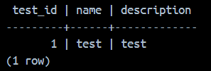

# docker-compose task

## Задание
Цель лабораторной: собрать из исходного когда и запустить в докере рабочее приложение с базой данных (любое опенсорс - Java, python/django/flask, golang).

1. Образ должен быть легковесным
2. Использовать базовые легковестные образы - alpine
3. Вся конфигурация приложения должна быть через переменные окружения
4. Статика (зависимости) должна быть внешним томом `volume`
5. Создать файл `docker-compose` для старта и сборки
6. В `docker-compose` нужно использовать базу данных (postgresql,mysql,mongodb etc.)
7. При старте приложения должно быть учтено выполнение автоматических миграций
8. Контейнер должен запускаться от непривилегированного пользователя
9. После установки всех нужных утилит, должен очищаться кеш

## Open-source проект
https://github.com/zeynepsl/CarShowroomProject

## Запуск 
Создание образа:

```
docker build -t car-showroom .
```

Создание контейнера:

```
docker-compose up --build
```

1) Логи успешного запуска приложения app


2) Логи успешного запуска БД


## Инициализация 
Файл начальной миграции: init.sql

1) Подключение к контейнеру базы данных
```
docker exec -it carshowroomproject-db-1 bash
```

2) Подключение к PostgreSQL
```
psql -U postgres
```

3) Переход к базе данных 
```
\c CarShowroom
```

4) Запрос данных, созданных при инициализации
```
select * from test;
```



## Тестирование

1) Запрос добавления бренда по внутренней API `POST /api/brands`:
```
curl --location 'http://localhost:8080/api/brands' \
--header 'Content-Type: application/json' \
--data '{
    "name": "BMW"
}'
```

2) Результат выполнения запроса в БД

